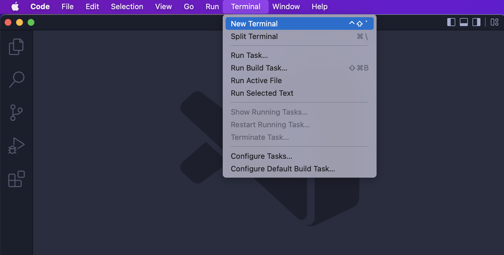
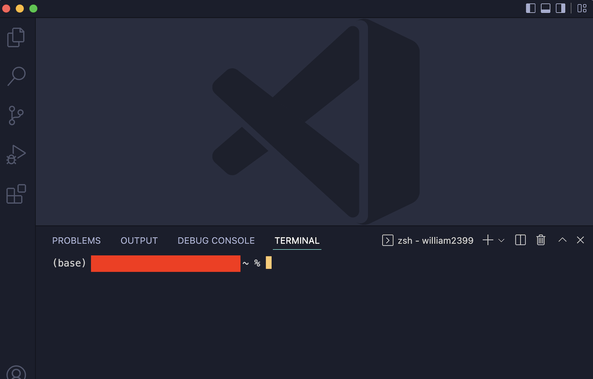
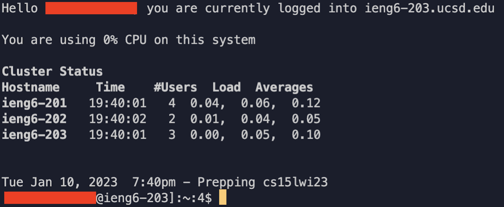
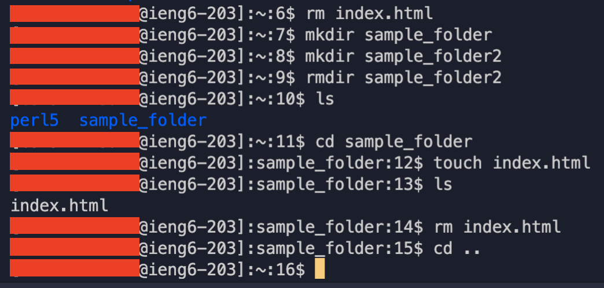
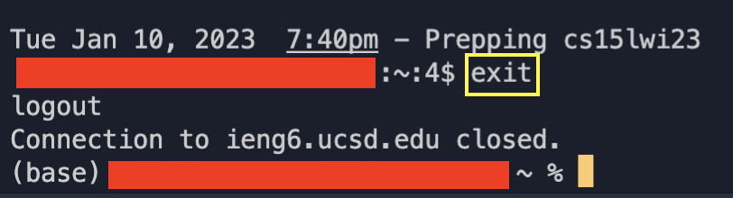
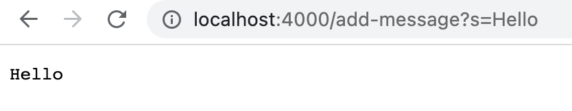
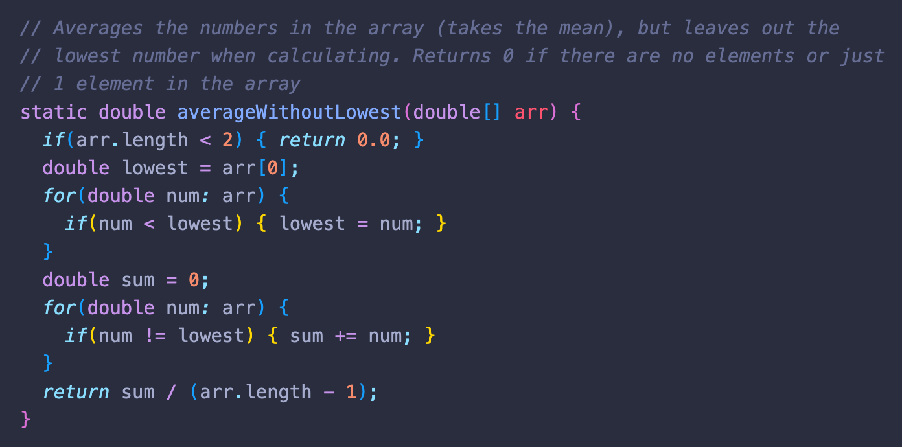
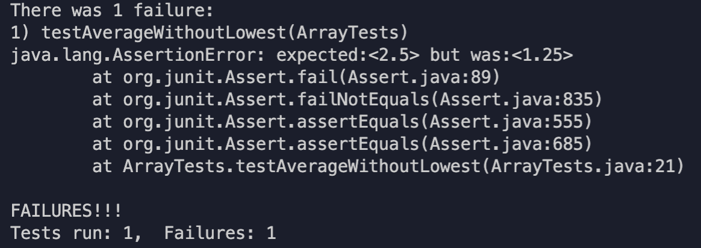
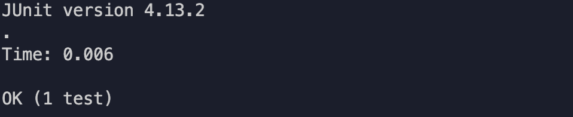

# Week 1 Lab Report (Monday, January 16)

## Installing VScode

**VSCode** is an Integrated Development Environment (IDE) that developers can use to efficiently write code. The editor provides additional functionality to improve one's quality of life including a debugger and auto-fill.

1. Head to the [VScode website](https://code.visualstudio.com/)

2. Download the installer that corresponds to your computer's operating system (ex. macOS, Windows x64, Linux x64)

   

3. After downloading the installer, click on it and follow instructions to install VSCode

4. Once successfully installed, click on the program to run it. A VSCode window like the one below should then appear

   

## Remotely Connecting

Next, we will explore how to work on a **remote computer** through VSCode. It is important for programmers to learn how to make use of remote servers, a skill relevant both in higher-education and the workforce.

1. In VSCode, open the terminal. You can use the Ctrl+` shortcut or clicking on 'New Terminal' found by hovering over the 'Terminal' option in the menu. 

   

2. A terminal at the bottom of your VSCode window should appear like so.

   

3. Follow the CSE 15L [[TUTORIAL] How to Reset your Password](https://docs.google.com/document/d/1hs7CyQeh-MdUfM9uv99i8tqfneos6Y8bDU0uhn1wqho/edit). Make sure you record your CSE 15L account username and its associated password somewhere safe!

4. Head back to your VSCode terminal and paste in the given command:  
    
   Remember to replace the *zz* with the letters at the end of your own CSE 15L account.

5. For your first time connecting to the server, you will receive a message that reads ...

   ```
   #First Time Message
   % ssh cs15lwi23zz@ieng6.ucsd.edu
   The authenticity of host 'ieng6-202.%csd.edu (128.54.70.227)' can't be established.
   RSA key fingerprint is SHA256:ksruYwhnYH+sySHnHAtLUHngrPEyZTDl/1x99wUQcec.
   Are you sure you want to continue connecting (yes/no/[fingerprint])? 
   Password: 
   ```
   Procced by typing in **yes** and then entering your account's password. 
   
   *Please note that your password won't be visable when you type it. Type in your password without any        mistakes!*
   
6. The terminal should now be connected remotely to another computer.

   

## Run Some Commands

Attempt to run basic terminal commands. This will help to build familiarity in operating the terminal, a tool that provides a plethora of useful functions and benefits. These range from easy access and manipulation of your computer's files/documents to remote access which we went into above.

1. Commands for you to try:

    <pre>
    - <i>touch</i>: Create file
    - <i>cp</i>: Copy file to specificed directory
    - <i>open</i>: Open file
    - <i>rm</i>: Delete file
    - <i>mkdir</i>: Create directory
    - <i>rmdir</i>: Delete empty directory
    - <i>rm -R</i>: Delete non-empty directory
    - <i>cd</i>: Change directory
    - <i>ls</i>: List directory
    - <i>pwd</i>: Print working directory
    </pre>
   

2. To exit from the remote computer, simply type in the command **exit**.

   

3. Try to run these commmands again on your personal computer once you unconnected from the remote server.


\pagebreak

# Week 3 Lab Report (Tuesday, January 24)

## Part 1: StringServer

```
//Code for StringServer.java

import java.io.IOException;
import java.net.URI;
import java.util.ArrayList;


class Handler implements URLHandler {
    ArrayList<String> string_list = new ArrayList<>();

    public String handleRequest(URI url) {
        if (url.getPath().contains("/add-message")) {
            String[] parameters = url.getQuery().split("=");
            if (parameters[0].equals("s")) {
                string_list.add(parameters[1]);
                String result = "";
                for (String item : string_list){
                    result+=item + "\n";
                }
                return result;
            }
            return "Not valid";
        } else {return string_list.toString();}
    }
}

class StringServer {
    public static void main(String[] args) throws IOException {
        if(args.length == 0){
            System.out.println("Missing port number! 
               Try any number between 1024 to 49151");
            return;
        }

        int port = Integer.parseInt(args[0]);

        Server.start(port, new Handler());
    }
}
```

1. **/add-message?s=Hello**

     
     
     * _Which methods in your code are called?_
       
       There are several methods in my code that are called when the user inputs the request /add-message?s=Hello. For starters, the handleRequest(URI url) method is called once the user enters in the updated url with the specified query. Inside this handleRequest method, a variety of pre-exisiting methods like getPath(), contains(), and add(). These combinations of methods allow for the server to identity the user's query and act with the appropriate response. In this case, we are looking to update the web page with each of the user's inputted strings.
       
     * _What are the relevant arguments to those methods, and the values of any relevant fields of the class?_

       A relevant argument that is inputted into the handleRequest is the argument URI url. This argument is the URL that the user provides to the web server. A field that is part of the Handler class is string_list, which is a String arraylist that holds each and every one of the strings the user provides.

     * _How do the values of any relevant fields of the class change from this specific request? If no values got changed, explain why._

       The one field of the class, string_list, is the main defining component that is impacted by a specific request. This is because with each request that seeks to add a message through the format /add-message?s=<string>, the field string_list is updated to include that given <string>. This is because one of the required functionality of the web page is to "keep track of a single string that gets added to by incoming requests". In this case, string_list is the variable that keeps a record of each "request".
   
2. **/add-message?s=How are you**
   
     
   
     * _Which methods in your code are called?_
   
        The same methods in my code are called for each add-message request the user specifies in the URL. For example, as long as the URL includes the correct part and formating of /add-message?s=<string>, the server will always follow the same method of adding the user's string to the page. To reiterate, once the user makes a request, the handleRequest(URI url) method is called. Within that method, an if statement checks if the path of the provided url contains "/add-message". This is an important check because else, the it is impossible to determine whether or not the user is looking to add a string. From there, the method is able to identify the user's string by splitting the "s=<string>" using the = symbol as a delimiter. The string is then added to the string_list and then prints out a string that contains all of the user's requests
   
     * _What are the relevant arguments to those methods, and the values of any relevant fields of the class?_

        The argument for the handleRequest() method is URI url. Note that the type is URI, not URL. There is no change/impact by using URI so it is important to recognize that it is valid and won't cause an error. The url argument is the specific url the user inputs. The field of the string_list is never reset so long as the web server is active. This is an important feature because else, if string_list is not a field of the class and rather of the method, it would be impossible to keep track of the user's prior requests.
   
        * _How do the values of any relevant fields of the class change from this specific request? If no values got changed, explain why._
   
        The string_list field will change so long as the specific request includes /add-message and a query that includes a user given <string>. The string_list is changed through the use of the add() method, which appends the current query's <string> to the end of the string_list. Because string_list is an arraylist, the server does not have to worry about the size of the array, as the size is mutable rather than fixed. For this reason, string_list will be as long as the number of add-message requests the user provides.
   
## Part 2: Analyzing Bugs
   
The bug I will analyze from Lab 3 is from the method **static double averageWithoutLowest(double[] arr)**, which can be found in ArrayExamples.java.
   
Here is what the method originally looked like without fixing the bug:
   
   
   
   * An example of a _failure-inducing input/test_ for this method is ...
   
   <pre>
   @Test
   public void testAverageWithoutLowest(){
       <strong> double[] input1 = {1,1,1,2,3}; </strong>
        assertEquals(2.5, ArrayExamples.averageWithoutLowest(input1), 0.1);
   }
   </pre>
   
   * An example of an input that _doesn't_ induce a failure ...
   
   <pre>
   @Test
   public void testAverageWithoutLowest(){
       <strong> double[] input2 = {1,2,3}; </strong>
        assertEquals(2.5, ArrayExamples.averageWithoutLowest(input2), 0.1);
   }
   </pre>
   
   * Symptom of _input1_
   
   
   
   * Symptom of _input2_
   
   
   
   * The bug, _as the before-and-after code change required to fix it_
   
   The bug that causes this error is that while the code can correctly identify what element in the input array is the lowest integer, it does not correctly count for instances in which the input array has multiple elements that are of the same lowest integer. The reason is because when it provides the division required to calculate the average, the length is not correctly subtracted. Instead of subtracting by the total amount of times in which the lowest integer appeared in the array, it always subtracts by a singular value of 1. The code of the bug can be seen below.
   
   <pre>
   //Bug - before change
   static double averageWithoutLowest(double[] arr) {
     if(arr.length < 2) { return 0.0; }
     double lowest = arr[0];
     for(double num: arr) {
       if(num < lowest) { lowest = num; }
     }
     double sum = 0;
     for(double num: arr) {
       if(num != lowest) { sum += num; }
     }
     <strong>return sum / (arr.length - 1);</strong>
   }
   </pre>
   
   In order to fix this bug, it is necessary to create a variable that is amount to count/record the total instances in whicht the lowest number appears. Then, this variable will be used as the value that the sum is divided by, thereby correctly performing the average of the input array wihtout accounting for the lowest integer/s in the array.
   
   <pre>
   //Fix Bug - after change
   static double averageWithoutLowest(double[] arr) {
     if(arr.length < 2) { return 0.0; }
     double lowest = arr[0];
     for(double num: arr) {
       if(num < lowest) { lowest = num; }
     }
     double sum = 0;
     <strong>int count = 0;</strong>
     for(double num: arr) {
       if(num != lowest) { sum += num; }
       if(num == lowest) { <strong>count+=1;</strong>}
     }
     <strong>return sum / (arr.length - count);</strong>
 }
   </pre>
   
   You can see that the fixed code includes a count variable that is first initialized to zero. When the input array is looped over using the for loop, an if conditional is added that first checks if the given number is equal to the identified lowest number and if it is, increase the count by one. This way, the count variable acts as a record that contains the total number of times the lowest int appears in the input array. Then, in the return statement at the end of the method, the sum is divided by the original length minus the count, thereby making sure that the average is only accounting for numbers in the input array that aren't the lowest integer.

## Part 3: Reflection
   
   * One thing that I was excited and glad to have learned in lab 2 about is how to build and run a server, especially a server on a remote computer. Not only can I run and test my code on a local server using my own personal computer, a server constructed on a remote machine can allow for multiple developers to work on and contribute to the server's code and files. Another interesting feature that I find to be useful is how the server's web page is no longer restricted to a local computer, but rather can be accessed by other computers as well.

\pagebreak
   
# Week 5 Lab Report (Thursday, February 9)
   
## Researching Commands 
   
The command I will focus on is *grep*, a command whose primary purpose is to search for a provided pattern such as a string or word within text files. For the 4 command-line options explored below for *grep*, I found out about them from two sources. 
   
The first resource I used is ChatGPT, where I simply provided the input prompt "what are some additional add-ons I can include with the grep command?". As a result, I received a lot of command options for *grep* and helpful corresponding descriptions.
   
On the other hand, I also used the command man in the terminal in order to find further information about the *grep* command. This was acheived by typing in the terminal *man grep*, which then outputed an informative and comprehensive list about the functionality of *grep*.
   
1. -r: short for "recursively", -r is a command option that makes it so that the given command like *grep* searches through not just the current directory, but also through all of its subdirectories. It is a useful command when you wish to find a specific item/pattern within a directory that contains not just a large amount of files, but also nested directories within as well. I find this to be one of the most useful command-line options because of its performance when searching through large collections of files and text. It saves a lot of time as opposed to manually searching for each and every single file to find the pattern you arelooking for. **Source: https://chat.openai.com/chat**
   
   * <pre>
     grep -r "loyalist" written_2/travel_guides/berlitz1/HistoryIbiza.txt
     written_2/travel_guides/berlitz1/HistoryIbiza.txt:        tragedy. Ibiza, Formentera, and Menorca were all captured by loyalist
     </pre> 
   
   * <pre>
      grep -r "shark" written_2/travel_guides/berlitz1/WhatToMadeira.txt
      written_2/travel_guides/berlitz1/WhatToMadeira.txt:        yellow-fin), barracuda, swordfish, wahoo, and shark (hammerhead, maco,
     </pre> 
   
2. -i: this option will ignore cases. In terms of the *grep* command, the matches will ignore distinctions between upper and lower letters. This is a great command to use if you do not care about the capitalization of the pattern you are searching for and just care about the word/string itself. There are many instances where the capitalization of a word does not matter. For example, say we have the user input 'Yes' or 'No'. Here, we should not care if the input has different capitalization like "YES" as opposed to "yes" since they're the same thing technically. **Source: https://chat.openai.com/chat**
   
    * <pre>
      grep -i "BREAD" written_2/travel_guides/berlitz1/WhatToJamaica.txt
      breadfruit along with the jerk to provide the perfect bland antidote to
        Captain Bligh of “The Bounty” fame first landed breadfruit on Jamaica.
      </pre> 
   
    * <pre>
      grep -i "RoYAlTy" written_2/travel_guides/berlitz1/WhatToMalaysia.txt
      royalty, but today elegant geometric or exuberant, stylized floral
        dagger motifs. Songket was originally reserved for royalty, but is
      </pre> 
   
3. -l: Rather than print the lines that contain the match of the pattern, provide the names of the files that have the match instead. This is a helpful option to use if you wish to only know the files that have the pattern you want to find. This is a very clean tool to use since oftentimes with the *grep* command, it will bombard you with walls of text that matches the search. However with the -l option, the output is much cleaner and arguably more useful for the programmer **Source: I found out about this command from the man command in the terminal**
   
    * <pre>
      grep -l "potato" written_2/travel_guides/berlitz1/*
      written_2/travel_guides/berlitz1/HandRIsrael.txt
      written_2/travel_guides/berlitz1/HistoryDublin.txt
      written_2/travel_guides/berlitz1/HistoryJapan.txt
      written_2/travel_guides/berlitz1/WhatToIbiza.txt
      written_2/travel_guides/berlitz1/WhereToEdinburgh.txt
      written_2/travel_guides/berlitz1/WhereToFWI.txt
      written_2/travel_guides/berlitz1/WhereToFrance.txt
      </pre> 

    * <pre>
      grep -l "cooking" written_2/travel_guides/berlitz2/*
      written_2/travel_guides/berlitz2/Bermuda-WhereToGo.txt
      written_2/travel_guides/berlitz2/Canada-History.txt
      written_2/travel_guides/berlitz2/Canada-WhereToGo.txt
      written_2/travel_guides/berlitz2/Cancun-WhatToDo.txt
      written_2/travel_guides/berlitz2/China-History.txt
      written_2/travel_guides/berlitz2/China-WhatToDo.txt
      written_2/travel_guides/berlitz2/China-WhereToGo.txt
      written_2/travel_guides/berlitz2/CostaBlanca-WhatToDo.txt
      written_2/travel_guides/berlitz2/Crete-WhatToDo.txt
      written_2/travel_guides/berlitz2/Cuba-WhatToDo.txt
      written_2/travel_guides/berlitz2/Nepal-WhatToDo.txt
      written_2/travel_guides/berlitz2/Portugal-WhatToDo.txt
      </pre> 
   
4. -L: The complete opposite of the -l command, -L will only print out the file names of those that do not match or contain the provided pattern. This can assist you when you want to know what files do not contain a specific keyword. Much for the same reasons as the -l option, the format it gives the output in is one of its most desirable factors. The -L option can be especially useful when you know that there are a lot of files without your specificed input. In this case, rather than have excessive amounts of text show, using -L can help save both time and effort when recording these file outputs **Source: I found out about this command from the man command in the terminal**
   
    * <pre>
      grep -L "people" written_2/travel_guides/berlitz2/*
      written_2/travel_guides/berlitz2/Algarve-Intro.txt
      written_2/travel_guides/berlitz2/Beijing-History.txt
      written_2/travel_guides/berlitz2/Beijing-WhatToDo.txt
      written_2/travel_guides/berlitz2/California-WhatToDo.txt
      written_2/travel_guides/berlitz2/CanaryIslands-WhatToDo.txt
      written_2/travel_guides/berlitz2/Paris-WhatToDo.txt
      written_2/travel_guides/berlitz2/Poland-WhatToDo.txt
      written_2/travel_guides/berlitz2/Portugal-WhatToDo.txt
      written_2/travel_guides/berlitz2/Vallarta-History.txt
      written_2/travel_guides/berlitz2/Vallarta-WhatToDo.txt
      </pre> 

    * <pre>
      grep -L "culture" written_2/travel_guides/berlitz2/*
      written_2/travel_guides/berlitz2/Algarve-Intro.txt
      written_2/travel_guides/berlitz2/Algarve-WhatToDo.txt
      written_2/travel_guides/berlitz2/Algarve-WhereToGo.txt
      written_2/travel_guides/berlitz2/Amsterdam-WhatToDo.txt
      written_2/travel_guides/berlitz2/Athens-Intro.txt
      written_2/travel_guides/berlitz2/Athens-WhatToDo.txt
      written_2/travel_guides/berlitz2/Athens-WhereToGo.txt
      written_2/travel_guides/berlitz2/Bahamas-Intro.txt
      written_2/travel_guides/berlitz2/Bahamas-WhatToDo.txt
      written_2/travel_guides/berlitz2/Beijing-WhatToDo.txt
      written_2/travel_guides/berlitz2/Beijing-WhereToGo.txt
      written_2/travel_guides/berlitz2/Bermuda-WhatToDo.txt
      written_2/travel_guides/berlitz2/Boston-WhereToGo.txt
      written_2/travel_guides/berlitz2/California-WhatToDo.txt
      written_2/travel_guides/berlitz2/CanaryIslands-WhatToDo.txt
      written_2/travel_guides/berlitz2/Cancun-WhatToDo.txt
      written_2/travel_guides/berlitz2/China-WhatToDo.txt
      written_2/travel_guides/berlitz2/Costa-WhatToDo.txt
      written_2/travel_guides/berlitz2/CostaBlanca-History.txt
      written_2/travel_guides/berlitz2/Crete-WhatToDo.txt
      written_2/travel_guides/berlitz2/Cuba-History.txt
      written_2/travel_guides/berlitz2/Nepal-WhatToDo.txt
      written_2/travel_guides/berlitz2/Nepal-WhereToGo.txt
      written_2/travel_guides/berlitz2/Paris-WhatToDo.txt
      written_2/travel_guides/berlitz2/Portugal-WhatToDo.txt
      </pre> 
  
# Week 8 Lab Report (Wednesday, February 22)

## Challenge Tasks
   
1. **Setup** Delete any existing forks of the repository you have on your account
   


*Keys pressed:* 
   
<pre>
 cd ..
 rm -rf lab7
 exit
</pre> 

The *cd ..* command is used to go back up to the parent directory, as currently we are in the lab7 directory. Next, to actually remove the directory from our remote server account, we can use the *rm -rm lab7*. Separating this command into individual parts, the *rm* is the general command to remove files and directories. The additional option *-rf* is necessary because the directory we want to delete has files contained inside of it so this option forcefully removes all of it and the directory itself. Finally, we specifically which directory we want to delete, which in this case is *lab7*. The next step is to back out ofthe remote account to go back toour local terminal, which is done using. the *exit* command.
   
**Note:** The *ls* commands seen in the above screenshot are not necessary to the process of deleting the *lab7* directory. they are only there to help the reader visualize what files and directories are present before and after the *rm* command
   
Then, go towards your github repository in order to delete it. You can do this by going to the browser that has the lab7, click to the far-right on *Settings*


   
Scroll to the bottom and click *Delete this repository*


   
You will be prompted to type in the name of the directory to delete it.
   
2. **Setup** Fork the repository
   
Go to the *lab 7 repo* and go to the top right and click the fork button. You will be directed to this page.
   


Click on 'Create fork' in order to create a forked repository of the *lab 7 repo*. The process will take a few seconds, but you should then see your newly created lab 7 repository. 
   
3. *The real deal* Start the timer!
   
4. Log into ieng6
 
5. Clone your fork of the repository from your Github acount
   
6. Run the tests, demonstrating that they fail
   
7. Edit the code file to fix the failing test
   
8. Run the tests, demonstrating that they now succeed
   
9. Commit and push the resulting change to your Github account
