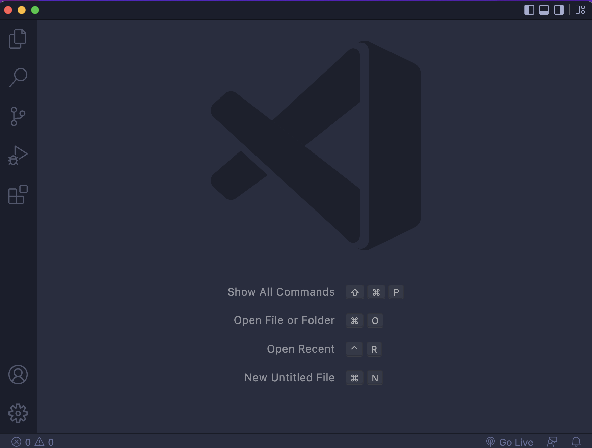

# Week 1 Lab Report (Monday, January 16)

## Installing VScode

Note: **VSCode** is an Integrated Development Environment (IDE) that assists developers in efficiently writing code. This editor also includes "powerful developer tooling, like IntelliSense code completion and debugging" (Visual Studio Code Website).

1. Head to the [VScode website](https://code.visualstudio.com/)

2. Download the installer that corresponds to your operating system (ex. macOS, Windows x64, Linux x64)

3. After downloading the installer, click on it and follow instructions in order to install VSCode.

4. Once installed, click on the program in order to run it. A window that looks like the image below should appear. 

## Remotely Connecting

1. 
