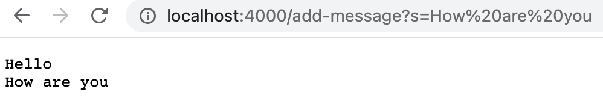
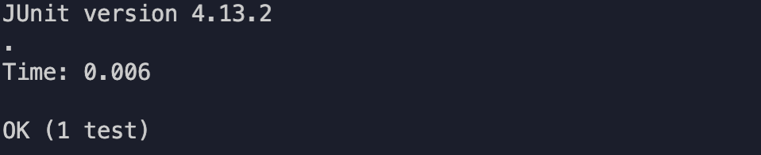

# Week 3 Lab Report (Tuesday, January 24)

## Part 1: StringServer

```
//Code for StringServer.java

import java.io.IOException;
import java.net.URI;
import java.util.ArrayList;


class Handler implements URLHandler {
    ArrayList<String> string_list = new ArrayList<>();

    public String handleRequest(URI url) {
        if (url.getPath().contains("/add-message")) {
            String[] parameters = url.getQuery().split("=");
            if (parameters[0].equals("s")) {
                string_list.add(parameters[1]);
                String result = "";
                for (String item : string_list){
                    result+=item + "\n";
                }
                return result;
            }
            return "Not valid";
        } else {return string_list.toString();}
    }
}

class StringServer {
    public static void main(String[] args) throws IOException {
        if(args.length == 0){
            System.out.println("Missing port number! 
               Try any number between 1024 to 49151");
            return;
        }

        int port = Integer.parseInt(args[0]);

        Server.start(port, new Handler());
    }
}
```

1. **/add-message?s=Hello**

     
     
     * _Which methods in your code are called?_
       
       There are several methods in my code that are called when the user inputs the request /add-message?s=Hello. For starters, the handleRequest(URI url) method is called once the user enters in the updated url with the specified query. Inside this handleRequest method, a variety of pre-exisiting methods like getPath(), contains(), and add(). These combinations of methods allow for the server to identity the user's query and act with the appropriate response. In this case, we are looking to update the web page with each of the user's inputted strings.
       
     * _What are the relevant arguments to those methods, and the values of any relevant fields of the class?_

       A relevant argument that is inputted into the handleRequest is the argument URI url. This argument is the URL that the user provides to the web server. A field that is part of the Handler class is string_list, which is a String arraylist that holds each and every one of the strings the user provides.

     * _How do the values of any relevant fields of the class change from this specific request? If no values got changed, explain why._

       The one field of the class, string_list, is the main defining component that is impacted by a specific request. This is because with each request that seeks to add a message through the format /add-message?s=<string>, the field string_list is updated to include that given <string>. This is because one of the required functionality of the web page is to "keep track of a single string that gets added to by incoming requests". In this case, string_list is the variable that keeps a record of each "request".
   
2. **/add-message?s=How are you**
   
     
   
     * _Which methods in your code are called?_
   
        The same methods in my code are called for each add-message request the user specifies in the URL. For example, as long as the URL includes the correct part and formating of /add-message?s=<string>, the server will always follow the same method of adding the user's string to the page. To reiterate, once the user makes a request, the handleRequest(URI url) method is called. Within that method, an if statement checks if the path of the provided url contains "/add-message". This is an important check because else, the it is impossible to determine whether or not the user is looking to add a string. From there, the method is able to identify the user's string by splitting the "s=<string>" using the = symbol as a delimiter. The string is then added to the string_list and then prints out a string that contains all of the user's requests
   
     * _What are the relevant arguments to those methods, and the values of any relevant fields of the class?_

        The argument for the handleRequest() method is URI url. Note that the type is URI, not URL. There is no change/impact by using URI so it is important to recognize that it is valid and won't cause an error. The url argument is the specific url the user inputs. The field of the string_list is never reset so long as the web server is active. This is an important feature because else, if string_list is not a field of the class and rather of the method, it would be impossible to keep track of the user's prior requests.
   
        * _How do the values of any relevant fields of the class change from this specific request? If no values got changed, explain why._
   
        The string_list field will change so long as the specific request includes /add-message and a query that includes a user given <string>. The string_list is changed through the use of the add() method, which appends the current query's <string> to the end of the string_list. Because string_list is an arraylist, the server does not have to worry about the size of the array, as the size is mutable rather than fixed. For this reason, string_list will be as long as the number of add-message requests the user provides.
   
## Part 2: Analyzing Bugs
   
The bug I will analyze from Lab 3 is from the method **static double averageWithoutLowest(double[] arr)**, which can be found in ArrayExamples.java.
   
Here is what the method originally looked like without fixing the bug:
   
   
   
   * An example of a _failure-inducing input/test_ for this method is ...
   
   <pre>
   @Test
   public void testAverageWithoutLowest(){
       <strong> double[] input1 = {1,1,1,2,3}; </strong>
        assertEquals(2.5, ArrayExamples.averageWithoutLowest(input1), 0.1);
   }
   </pre>
   
   * An example of an input that _doesn't_ induce a failure ...
   
   <pre>
   @Test
   public void testAverageWithoutLowest(){
       <strong> double[] input2 = {1,2,3}; </strong>
        assertEquals(2.5, ArrayExamples.averageWithoutLowest(input2), 0.1);
   }
   </pre>
   
   * Symptom of _input1_
   
   
   
   * Symptom of _input2_
   
   
   
   * The bug, _as the before-and-after code change required to fix it_
   
   The bug that causes this error is that while the code can correctly identify what element in the input array is the lowest integer, it does not correctly count for instances in which the input array has multiple elements that are of the same lowest integer. The reason is because when it provides the division required to calculate the average, the length is not correctly subtracted. Instead of subtracting by the total amount of times in which the lowest integer appeared in the array, it always subtracts by a singular value of 1. The code of the bug can be seen below.
   
   <pre>
   //Bug - before change
   static double averageWithoutLowest(double[] arr) {
     if(arr.length < 2) { return 0.0; }
     double lowest = arr[0];
     for(double num: arr) {
       if(num < lowest) { lowest = num; }
     }
     double sum = 0;
     for(double num: arr) {
       if(num != lowest) { sum += num; }
     }
     <strong>return sum / (arr.length - 1);</strong>
   }
   </pre>
   
   In order to fix this bug, it is necessary to create a variable that is amount to count/record the total instances in whicht the lowest number appears. Then, this variable will be used as the value that the sum is divided by, thereby correctly performing the average of the input array wihtout accounting for the lowest integer/s in the array.
   
   <pre>
   //Fix Bug - after change
   static double averageWithoutLowest(double[] arr) {
     if(arr.length < 2) { return 0.0; }
     double lowest = arr[0];
     for(double num: arr) {
       if(num < lowest) { lowest = num; }
     }
     double sum = 0;
     <strong>int count = 0;</strong>
     for(double num: arr) {
       if(num != lowest) { sum += num; }
       if(num == lowest) { <strong>count+=1;</strong>}
     }
     <strong>return sum / (arr.length - count);</strong>
 }
   </pre>
   
   You can see that the fixed code includes a count variable that is first initialized to zero. When the input array is looped over using the for loop, an if conditional is added that first checks if the given number is equal to the identified lowest number and if it is, increase the count by one. This way, the count variable acts as a record that contains the total number of times the lowest int appears in the input array. Then, in the return statement at the end of the method, the sum is divided by the original length minus the count, thereby making sure that the average is only accounting for numbers in the input array that aren't the lowest integer.

## Part 3: Reflection
   
   * One thing that I was excited and glad to have learned in lab 2 about is how to build and run a server, especially a server on a remote computer. Not only can I run and test my code on a local server using my own personal computer, a server constructed on a remote machine can allow for multiple developers to work on and contribute to the server's code and files. Another interesting feature that I find to be useful is how the server's web page is no longer restricted to a local computer, but rather can be accessed by other computers as well.
